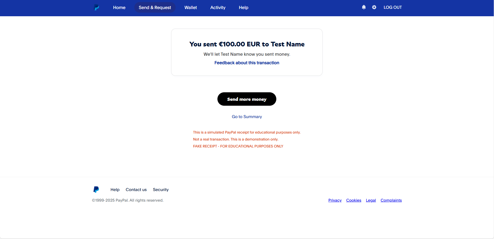

# PayPal Receipt Generator



Generate PayPal-style receipts in multiple languages and currencies.  
Customizable, responsive, and perfect for demos, educational, or testing purposes.

---

## Features

- 🧾 **PayPal-style HTML receipt output**
- 🌍 **Multi-language:** English, Portuguese, Egyptian Arabic (RTL)
- 💱 **Multi-currency:** USD, EUR, GBP, EGP, BRL, and more
- ✏️ **Customizable transaction details**
- 📱 **Responsive and print-friendly**
- 🚨 **Clearly marked as FAKE for educational/demo use**

---

## Demo


---

## Usage

1. **Clone the repo:**
   ```bash
   git clone https://github.com/yourusername/paypal-receipt-generator.git
   cd paypal-receipt-generator
   ```

2. **Install requirements (if any):**
   ```bash
   pip install -r requirements.txt
   ```

3. **Run the generator:**
   ```bash
   python fake_html.py
   ```

4. **Customize:**
   - Edit the parameters in `fake_html.py` to set name, email, amount, recipient, currency, and language.

---

## Example

```python
from fake_html import create_paypal_receipt_html

create_paypal_receipt_html(
    name="John Doe",
    email="john@example.com",
    amount=100.00,
    recipient="Jane Smith",
    transaction_type="Payment",
    currency="USD",   # Try "USD", "EUR", "GBP", "EGP", "BRL"
    lang="en"         # Try "en", "pt", or "ar-eg"
)
```

---

## Supported Languages

- English (`en`)
- Portuguese (`pt`)
- Egyptian Arabic (`ar-eg`)

## Supported Currencies

- USD, EUR, GBP, EGP, BRL (easy to add more!)

---

## Disclaimer

> **This tool is for educational, demonstration, and testing purposes only.  
> All receipts are clearly marked as fake and should not be used for fraudulent or deceptive activities.**

---

## License

MIT

---

## Contributing

Pull requests and suggestions are welcome! 